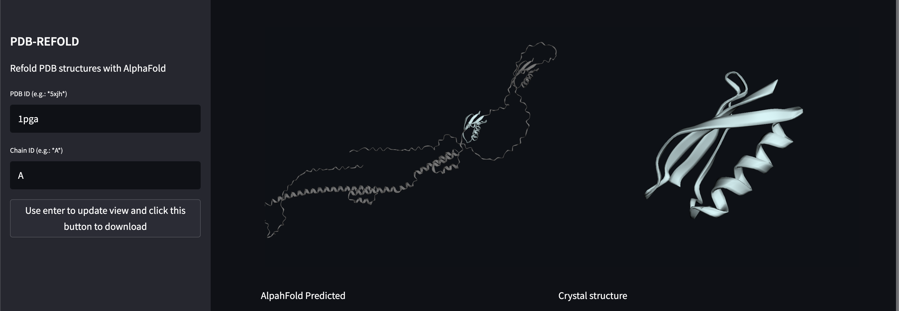
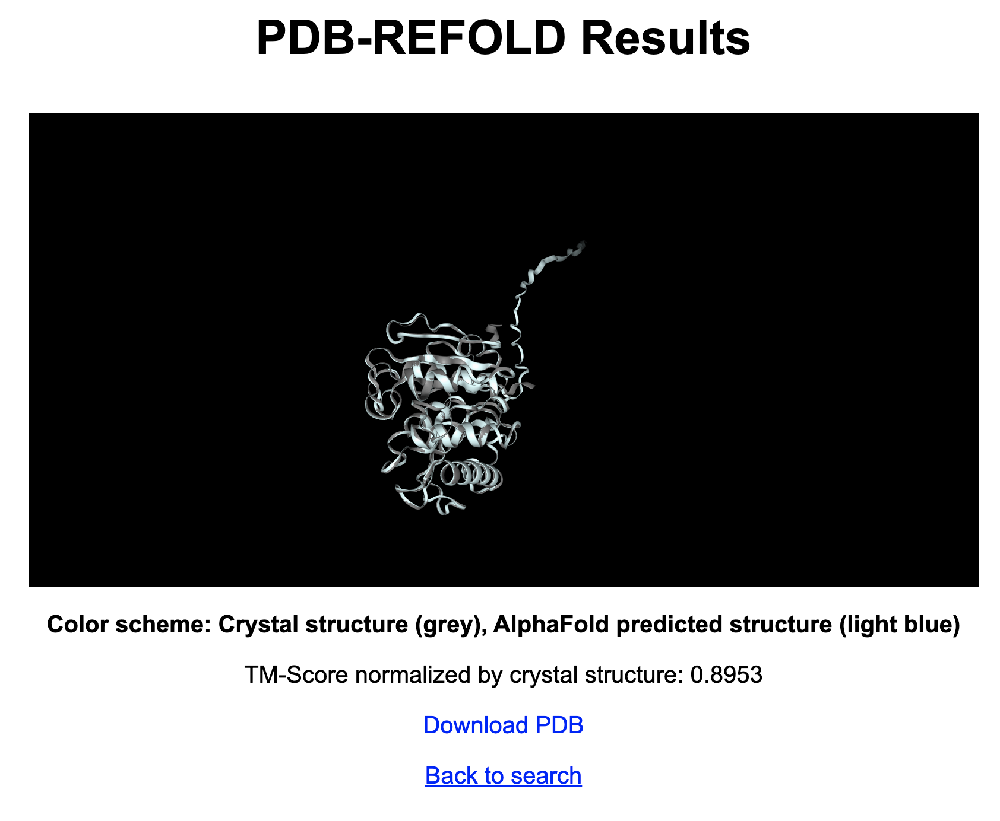

# PDB-REFOLD
PDB-REFOLD is a web application that refolds protein structures from the Protein Data Bank (PDB) using AlphaFold predictions. The application aligns and superposes the crystal structure with the predicted structure and calculates the TM-score to assess the quality of the alignment.

## Features
- Aligns and superposes PDB crystal structures with AlphaFold predictions  
- Visualizes the original crystal structure and the refolded structure using NGL Viewer  
- Calculates the TM-score to assess the quality of the alignment  
- Allows downloading of the refolded PDB file  

## Demos:
[Web App](https://jinyuansun-pdbrefold-pdbrefold-q8a8us.streamlit.app/)

[Web Page](http://103.79.77.89:5078/)

